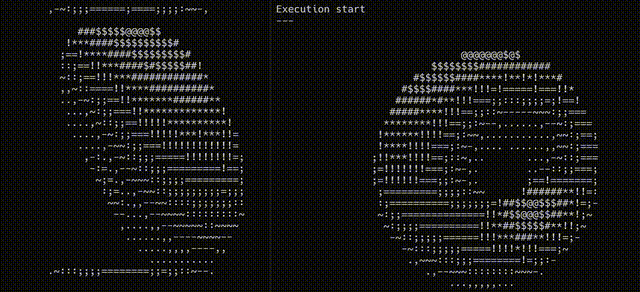

  

<h1 align="center">Aditya Chawla</h1>
 
 
// Manipal'27  
// Exploring AI systems, autonomous workflows, and developer tooling  
// Interested in full-stack development, applied AI, and systems programming  
// Contributing to Open Source!

 
- **Finalist** — OpenAI Buildathon 2025
- **Microsoft AI Unlocked** — Top 250 teams
- **Google Big Code 2026** — Top 1500 students
- **SAP HackFest'25** — Hub Round Finalist
- **Hacktoberfest 2025** Contributor
- **Amazon ML School 2026**

 
 
## Connect With Me
 

  
  

 

